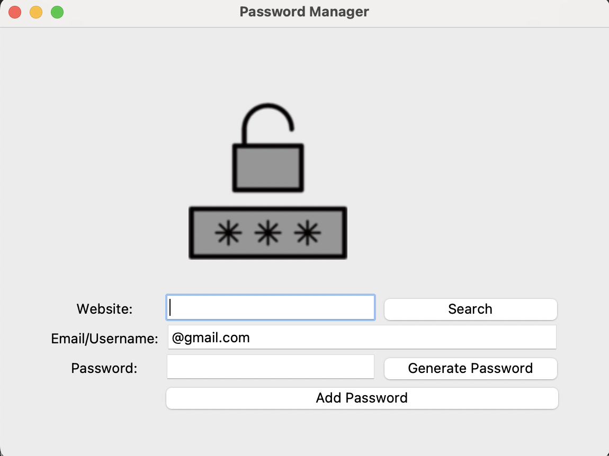

# password-generator

## Gestor de contraseñas

Este es un gestor de contraseñas creado con Python y la biblioteca Tkinter para la interfaz gráfica. Permite generar, almacenar y recuperar contraseñas de manera segura utilizando un archivo JSON.

### Características

- Generador de contraseñas seguras: Crea contraseñas aleatorias con letras, números y símbolos.

- Almacenamiento de credenciales: Guarda las contraseñas en un archivo JSON para su posterior recuperación.

- Búsqueda de contraseñas: Recupera credenciales almacenadas mediante el nombre del sitio web.

- Interfaz gráfica intuitiva: Construida con Tkinter para una fácil interacción.

### Requisitos

Asegúrate de tener instaladas las siguientes dependencias antes de ejecutar el programa:

pip install pyperclip

### Funcionamiento

Añadir una nueva contraseña

- Ingresa el nombre del sitio web, el correo/usuario y genera o escribe una contraseña.

- Presiona el botón "Add Password" para guardarla.

- Generar una contraseña segura

- Haz clic en "Generate Password" y se insertará automáticamente en el campo de contraseña.

- La contraseña también se copia al portapapeles.

- Buscar una contraseña guardada

- Escribe el nombre del sitio web en la barra de búsqueda y presiona "Search".

- Si existe, se mostrará un cuadro de diálogo con la información guardada.

## Password Manager

This is a password manager created with Python and the Tkinter library for the graphical interface. It allows you to generate, store, and retrieve passwords securely using a JSON file.

### Features

- Secure password generator: Creates random passwords with letters, numbers, and symbols.

- Credential storage: Saves passwords in a JSON file for later retrieval.

- Password search: Retrieves stored credentials by website name.

- Intuitive graphical interface: Built with Tkinter for easy interaction.

### Requirements

Make sure you have the following dependencies installed before running the program:

pip install pyperclip

##How It Works

- Add a new password

- Enter the website name, email/username, and either generate or manually input a password.

- Click the "Add Password" button to save it.

- Generate a secure password

- Click "Generate Password" to create a random password, which will automatically be inserted into the password field.

- The password is also copied to the clipboard for convenience.

- Search for a stored password

- Enter the website name in the search bar and click "Search."

- If found, a pop-up will display the stored email and password.

